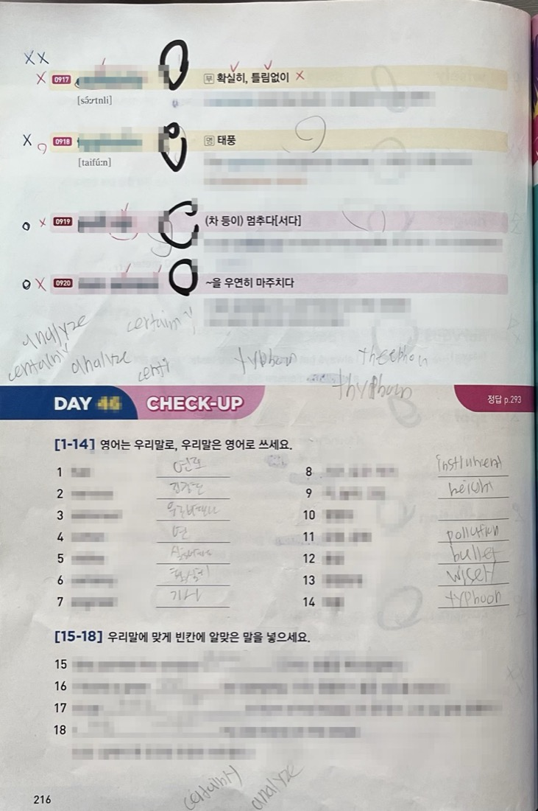
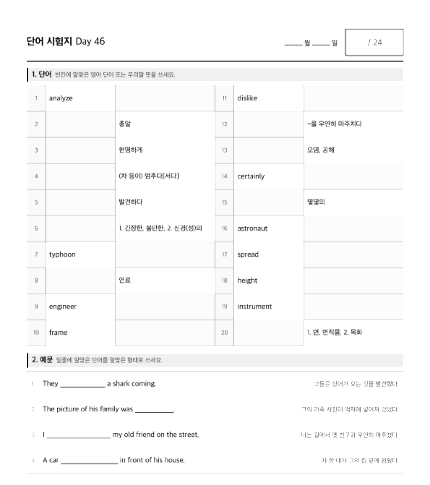
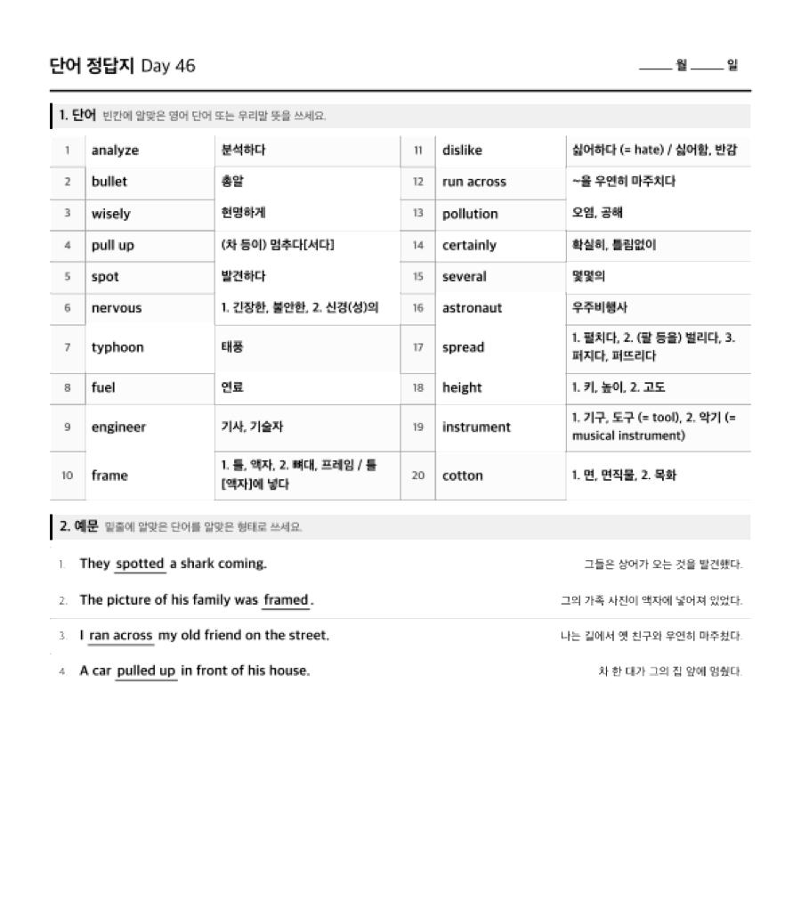

# vocab-tutor-skills

Two [Claude Code](https://claude.com/claude-code) skills for English vocabulary
tutoring. Photograph a workbook page, get a clean Markdown word list, then turn
that list into a printable A4 test paper and answer key.

Built for Korean vocabulary workbooks (워드마스터, 능률 보카, and similar) that
are organised into numbered Days.

| Skill | What it does |
| --- | --- |
| `vocabulary-photo-to-md` | Reads photos of a workbook page and writes `Day46.md` — headwords, meanings, example sentences and their printed translations. Skips handwriting and grading marks. |
| `vocabulary-quiz-generator` | Turns `Day46.md` into `Day46-test.pdf` and `Day46-answer.pdf` — a two-up word table plus cloze sentences, ready to print. |

## What it looks like

Photograph the workbook page — handwriting, highlighter and grading marks and
all. (English headwords are masked in these samples.)

<p>
  
  
</p>

You get a clean Markdown word list, and from that, a test paper and answer key:

<p>
  
  
</p>

## Install

```
/plugin marketplace add munjkim/vocab-tutor-skills
/plugin install vocab-tutor-skills
```

## Use

Attach photos of a workbook page and ask:

> Day 47 단어 정리해줘

You get `Day47.md`:

```markdown
# Day 47

### 1. liberty: 명사 - 자유 (= freedom)

- They fought to defend **liberty**. (그들은 자유를 지키기 위해 싸웠다.)

### 4. deliver: 동사 - 1. 배달하다, 2. (연설·강연 등을) 하다

- I **deliver** newspapers every morning. (나는 매일 아침 신문을 배달한다.)
- 관련어: delivery: 명사 - (우편물 등의) 배달, 배송
```

Then ask:

> Day 47 시험지 만들어줘

Claude asks whether to add review words the student missed on earlier Days, then
writes `Day47-test.pdf` and `Day47-answer.pdf` next to the Markdown.

The test paper puts 20 words in a two-up table — half ask for the English word,
half for the Korean meaning — followed by four cloze sentences that prefer
inflected forms (`framed`, `spotted`, `ran across`). The answer key matches it
question for question.

## What the extraction skill will not do

- It copies the printed translation; it never writes its own.
- It marks anything it cannot read clearly as `[판독 불가]` rather than guessing.
- It ignores handwriting, highlighter, circles, checks and the student's answers.

## Running the generator directly

The quiz generator is a plain Python script, usable without Claude:

```bash
SKILL=~/.claude/plugins/.../skills/vocabulary-quiz-generator/scripts

python3 $SKILL/generate_quiz.py Day46.md          # HTML + PDF
python3 $SKILL/verify_quiz.py  Day46.md           # automated checks
```

See [`skills/vocabulary-quiz-generator/README.md`](skills/vocabulary-quiz-generator/README.md)
for every flag.

## Requirements

Python 3 (standard library only) and Chrome or Chromium for PDF output.

## License

MIT
