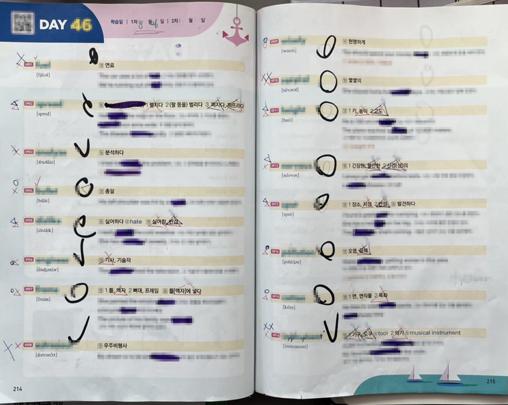
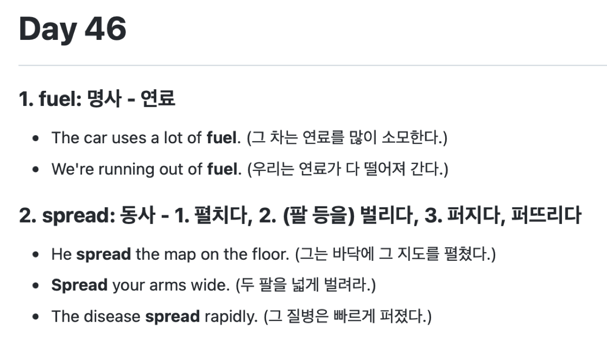
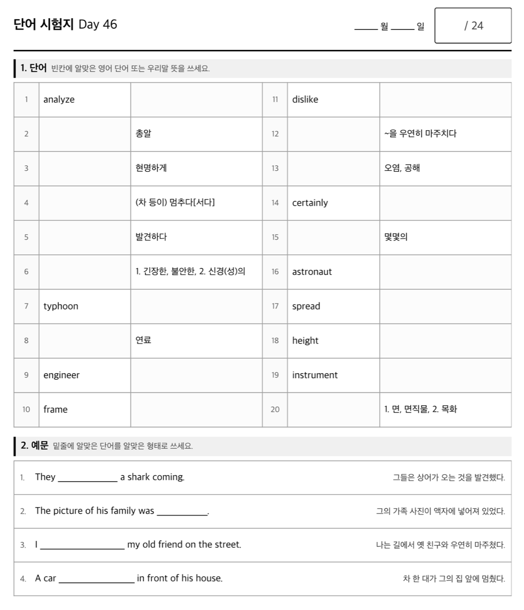

# vocab-tutor-skills

Three [Claude Code](https://claude.com/claude-code) skills for English
vocabulary tutoring. Photograph a workbook page, get a clean Markdown word list,
then turn that list into a printable A4 test paper and answer key — or go from
the photos straight to the test paper in one pass.

Built for Korean vocabulary workbooks (워드마스터, 능률 보카, and similar) that
are organised into numbered Days.

| Skill | What it does |
| --- | --- |
| `vocabulary-photo-to-md` | Reads photos of a workbook page and writes `Day46.md` — headwords, meanings, example sentences and their printed translations. Skips handwriting and grading marks. |
| `vocabulary-quiz-generator` | Turns `Day46.md` into `Day46-test.pdf` and `Day46-answer.pdf` — a two-up word table plus cloze sentences, ready to print. |
| `vocabulary-photo-to-quiz` | Runs both of the above in one pass, for when you want the test paper and do not need the Markdown as a separate step. |

## How it works

Photograph the workbook page — handwriting, highlighter and grading marks and
all. (English headwords are masked in this sample.)

<p align="center">
  
</p>

<p align="center"><b>↓</b>&nbsp;&nbsp;<code>vocabulary-photo-to-md</code></p>

<p align="center">
  
</p>

<p align="center"><b>↓</b>&nbsp;&nbsp;<code>vocabulary-quiz-generator</code></p>

<p align="center">
  
</p>

An answer key is generated alongside the test paper, matching it question for
question.

Each arrow is a skill you can invoke on its own. `vocabulary-photo-to-quiz`
runs both of them back to back, stopping only if the extraction looks
unreliable — a misread word or a page that is not a full Day.

## Install

```
/plugin marketplace add munjkim/vocab-tutor-skills
/plugin install vocab-tutor-skills
```

## Use

Attach photos of a workbook page and ask:

> Day 47 단어 정리해줘

You get `Day47.md` — headwords in textbook order, each with its meanings,
example sentences and the printed Korean translations. Then ask:

> Day 47 시험지 만들어줘

Claude asks whether to add review words the student missed on earlier Days, then
writes `Day47-test.pdf` and `Day47-answer.pdf` next to the Markdown.

To skip the middle step entirely, attach the photos and ask for the test paper
directly:

> 사진으로 Day 47 시험지 만들어줘

The test paper puts 20 words in a two-up table — half ask for the English word,
half for the Korean meaning — followed by four cloze sentences that prefer
inflected forms (`framed`, `spotted`, `ran across`).

## What the extraction skill will not do

- It copies the printed translation; it never writes its own.
- It marks anything it cannot read clearly as `[판독 불가]` rather than guessing.
- It ignores handwriting, highlighter, circles, checks and the student's answers.

## Running the generator directly

The quiz generator is a plain Python script, usable without Claude:

```bash
SKILL=~/.claude/plugins/marketplaces/vocab-tutor-skills/skills/vocabulary-quiz-generator/scripts

python3 $SKILL/generate_quiz.py Day46.md          # HTML + PDF
python3 $SKILL/verify_quiz.py  Day46.md           # automated checks
```

It writes the PDFs next to the input file and puts the HTML and the shared quiz
definition in a `build/` subfolder.

See [`skills/vocabulary-quiz-generator/README.md`](skills/vocabulary-quiz-generator/README.md)
for every flag.

## Requirements

Python 3 — standard library only, no packages to install — and Chrome or
Chromium, which the generator locates on its own, for PDF output. Pass
`--no-pdf` to stop at HTML if no browser is available.

## License

MIT
